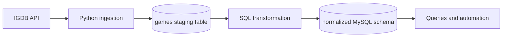

# ISpyGameDatabase

ISpyGameDatabase is a MySQL data-engineering and analytics project built from video-game data retrieved through the IGDB API. A Python ingestion program loads API results into a staging table. SQL scripts then transform that source data into a normalized relational schema for analytical queries, wishlist operations, and change auditing.

## Data pipeline



The pipeline has two stages:

1. `igdb_import.py` authenticates through Twitch, retrieves game data from IGDB, transforms nested API fields, and upserts the records into the `games` staging table.
2. `sql/schema_and_population.sql` converts the staging data into normalized entities and relationships.

## Database design

The normalized schema contains:

- `Developer` and `Game`
- `Language` and `GameLanguage`
- `Platform` and `GamePlatform`
- `Category` and `GameCategory`
- `User` and `Wishlist`
- `GameRatingLog` and `WishlistLog`

`GameLanguage`, `GamePlatform`, and `GameCategory` model many-to-many relationships with composite primary keys. Foreign keys preserve relationships between the main entities.

The project also demonstrates:

- Recursive common table expressions for parsing staged language, platform, and category values
- Joins, subqueries, aggregations, and calculated summaries
- Triggers that audit wishlist and rating changes
- A stored procedure for adding and displaying wishlist entries
- A stored function that calculates a user's wishlist count

## Repository structure

```text
ISpyGameDatabase/
|-- README.md
|-- igdb_import.py
|-- requirements.txt
|-- .env.example
|-- .gitignore
|-- databasedesign/
|   |-- DataDogsERDandSchema.pdf
|   `-- datadogs_Schema.mwb
`-- sql/
    |-- schema_and_population.sql
    |-- triggers_functions_automation.sql
    |-- queries.sql
    `-- data_dogs_dump.sql
```

## Prerequisites

- Python 3.10 or newer
- MySQL 8.0
- An IGDB API application registered through Twitch
- MySQL Workbench is optional but useful for running and reviewing the SQL files

## Setup on Windows PowerShell

Create and activate a virtual environment:

```powershell
python -m venv .venv
.\.venv\Scripts\Activate.ps1
pip install -r requirements.txt
```

Create a local configuration file:

```powershell
Copy-Item .env.example .env
```

Open `.env` and replace the placeholder values with your Twitch and local MySQL credentials. The `.gitignore` file prevents `.env` from being committed.

Run the importer:

```powershell
python igdb_import.py
```

The importer creates the configured database and the `games` staging table if they do not already exist. It retrieves 1,500 games by default. Change `TOTAL_GAMES` in `.env` to use a different positive value.

## Build the normalized database

After the Python importer finishes, select the database configured by `DB_NAME` in MySQL Workbench. Run the SQL files in this order:

1. `sql/schema_and_population.sql`
2. `sql/triggers_functions_automation.sql`
3. `sql/queries.sql`

The schema-and-population script inserts synthetic demonstration users and generates sample wishlist activity with randomized dates. Run it on a new database because its table-creation and sample-data statements are intended for initial setup.

`sql/data_dogs_dump.sql` is a populated MySQL dump provided as an optional restore point. It is not required when building the database through the ingestion and transformation workflow.

## Security

Never place API secrets or database passwords directly in source code. Keep them in `.env`, do not commit that file, and rotate a credential immediately if it is accidentally shared or pushed to a public repository.

## Data notes

IGDB returns nested arrays for fields such as developers, languages, platforms, and genres. The Python importer serializes these values into the staging table. The SQL transformation script parses the staged values and loads the corresponding normalized tables and junction tables.

The current `Game` table associates each game with the first listed developer. Languages, platforms, and categories retain many-to-many mappings through junction tables.
